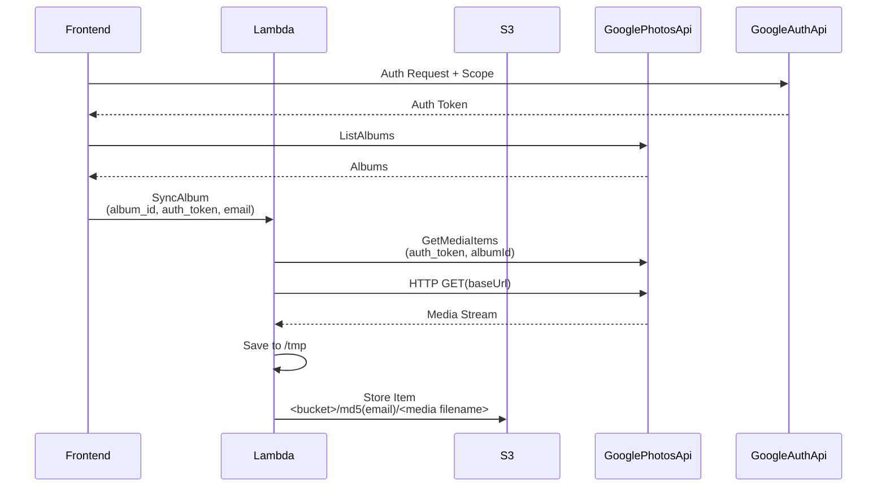

# media-importer

This POC aims to provide a system using aws infrastructure to import a users media from their google photos account to an s3 location.

This poc demo uses:
- cdktf for infrastructure deployment to aws
- react for a small frontend page to demo the api calls
- google auth for logging and authentication
- google photos api to retrieve a list fo the users albums
- api gateway, lambda and the google photos api to perform a sync operation to download all of the users media from a given album


### Install

1. Create env files

```
ENV=dev
REGION=<aws region>
ACCOUNT_ID=<your aws account id>
PIPENV_VERBOSITY=-1
JSII_SILENCE_WARNING_DEPRECATED_NODE_VERSION=True

```

2. Deploy with terraform


```
source .env && cdktf destroy
```

3.  Terraform output will show the site url. Use this to open the demo site.
```
    media-importer-frontend
      s3-website-endpoint = media-importer-site.s3-website-us-east-1.amazonaws.com
```


### Sequence Flow


### Design Considerations
- Time considerations syncing large number of items
    - batch or lambda
- Paging items in the request
- Storing user id/token for long running
    Email/some other id
- Using refresh token to “watch” the album
    - set access_type to "offline" to gain refresh_token
    - Storing tokens must be secure
    - this does require a few hacks to "get updates'
        - If the number of photos in the album is changed, it can be known by the property of mediaItemsCount.
        - If the cover photo is changed, it can be known by the property of coverPhotoBaseUrl.
        - If several photos in a album are changed without increasing and decreasing the number of photos, unfortunately, in the current stage, I think that it is required to confirm the creationTime, filename and so on using the method of mediaItems.list.


### Resources
